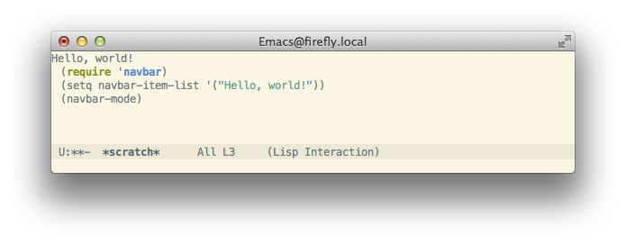
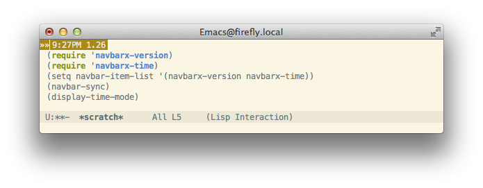
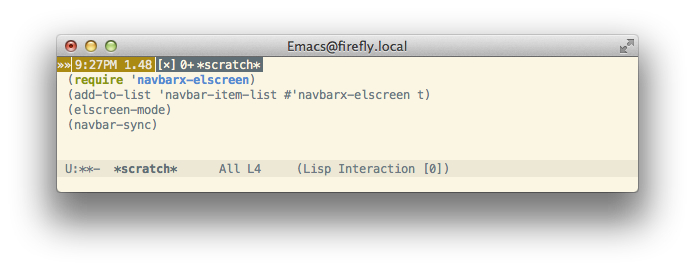

navbar.el
=========

navbar.el is a navigation bar for Emacs.
Just like the navbar component of [Bootstrap](http://getbootstrap.com/),
navbar.el can contain various components called navbar items.

navbar.el requires Emacs 24.4 or later.

Installation
------------

Put `navbar.el` and `navbarx-*.el` somewhere in your `load-path`.

Getting Started
---------------

1. This is the "Hello, world!" example:
   

2. The element of `navbar-item-list` may be a function which returns a property list.  To reflect the change of `navbar-item-list`, run `navbar-sync`:
   

3. `navbarx-elscreen` displays ElScreen tabs in the navbar buffer:
   
